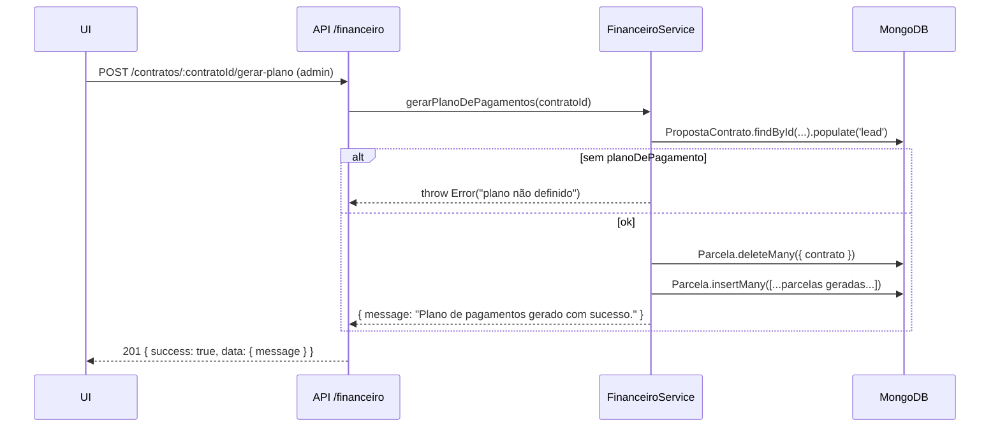
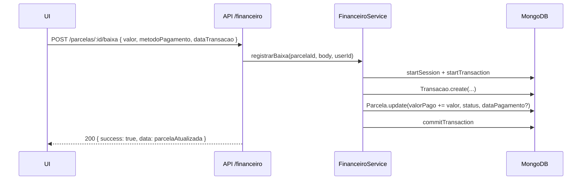

# 📒 Módulo Financeiro (Contas a Receber/Pagar) — Documentação

Documentação consolidada do módulo Financeiro (backend + frontend) com base nos arquivos fornecidos.

---

## Sumário

* [Visão Geral](#visão-geral)
* [Arquitetura](#arquitetura)
* [Backend](#backend)

  * [Models](#models)
  * [Services](#services)
  * [Controllers](#controllers)
  * [Routes](#routes)
  * [Configurações extras](#configurações-extras)
* [Frontend](#frontend)

  * [Camada de API (`src/api/...`)](#camada-de-api-srcapI)
  * [Páginas e Componentes](#páginas-e-componentes)
  * [Hooks, estados e props](#hooks-estados-e-props)
  * [CSS](#css)
* [Fluxos](#fluxos)
* [Evoluções Futuras](#evoluções-futuras)
* [FAQ / Solução de Problemas](#faq--solução-de-problemas)
* [Checklist de Integração](#checklist-de-integração)
* [Changelog](#changelog)

---

## Visão Geral

O módulo financeiro cobre:

* **Contas a Receber**: geração de plano de pagamentos por contrato, criação de parcelas avulsas, listagem com filtros/paginação, e **baixa de parcelas** com registro em `Transacao`.
* **Contas a Pagar**: cadastro de **Credores**, criação/listagem de **Despesas** e **pagamento** de despesas.
* **Dashboard** (KPIs): valores agregados de recebíveis/vencidos/recebidos no mês.

Autenticação/Autorização via middlewares `protect` e `authorize`. Endpoints agrupados em `/api/financeiro`.

---

## Arquitetura

```text
backend/
├─ controllers/
│  └─ FinanceiroController.js
├─ routes/
│  └─ financeiro.routes.js
├─ services/
│  └─ FinanceiroService.js
├─ models/
│  ├─ Parcela.js
│  ├─ Transacao.js
│  ├─ Despesa.js
│  └─ Credor.js
└─ middlewares/
   ├─ authMiddleware.js       // protect, authorize
   └─ asyncHandler.js

frontend/
├─ src/api/
│  └─ financeiroApi.js
├─ src/pages/Financeiro/
│  ├─ FinanceiroPage.jsx
│  ├─ FinanceiroPage.css
│  ├─ components/
│  │  ├─ KpiCards.jsx
│  │  ├─ ModalBaixaPagamento.jsx
│  │  ├─ CriarCredorModal.jsx
│  │  └─ CriarDespesaModal.jsx
│  └─ tabs/
│     ├─ ParcelasTab.jsx          // TODO: confirmar (não enviado)
│     ├─ ContasAPagarTab.jsx      // TODO: confirmar (não enviado)
│     └─ AdmFinanceiroTab.jsx     // TODO: confirmar (não enviado)
└─ src/utils/
   └─ currency.js (formatCurrencyBRL) // TODO: confirmar (não enviado)
```

---

## Backend

### Models

#### `Parcela`

Campos principais:

* `contrato` (ObjectId → `PropostaContrato`, idx, opcional)
* `sacado` (ObjectId → `Lead`, **required**, idx)
* `company` (ObjectId → `Company`, **required**, idx)
* `numeroParcela` (Number, **required**)
* `tipo` (String, **required**, enum: `"ATO" | "PARCELA MENSAL" | "PARCELA BIMESTRAL" | "PARCELA TRIMESTRAL" | "PARCELA SEMESTRAL" | "INTERCALADA" | "ENTREGA DE CHAVES" | "FINANCIAMENTO" | "OUTRA"`)
* `valorPrevisto` (Number, **required**)
* `valorPago` (Number, default `0`)
* `dataVencimento` (Date, **required**, idx)
* `dataPagamento` (Date)
* `status` (String, enum: `Pendente | Pago | Pago com Atraso | Atrasado | Cancelado | Renegociada`, default `Pendente`, idx)
* `historicoAlteracoes` (Array com `{data, usuario, campo, valorAntigo, valorNovo, motivo}`)
* `observacoes` (String)
* Indexes: `{ company, status, dataVencimento }`, `{ company, dataVencimento }`, `{ company, sacado }`.

Regras/observações:

* Status é atualizado ao registrar baixa.
* `valorPago` acumula múltiplas transações parciais.

#### `Transacao`

* `parcela` (ObjectId → `Parcela`, **required**, idx)
* `contrato` (ObjectId → `PropostaContrato`, **required**)
* `sacado` (ObjectId → `Lead`, **required**, idx)
* `company` (ObjectId → `Company`, **required**, idx)
* `valor` (Number, **required**)
* `metodoPagamento` (String, enum: `PIX | Transferência | Boleto | Cartão | Dinheiro | Outro`, **required**)
* `dataTransacao` (Date, **required**)
* `registradoPor` (ObjectId → `User`, **required**)
* `comprovanteUrl` (String, opcional)

#### `Despesa`

* `descricao` (String, **required**)
* `credor` (ObjectId → `Credor`, **required**, idx)
* `contrato` (ObjectId → `PropostaContrato`, opcional)
* `company` (ObjectId → `Company`, **required**, idx)
* `valor` (Number, **required**)
* `dataVencimento` (Date, **required**, idx)
* `dataPagamento` (Date)
* `status` (String, enum: `A Pagar | Paga | Atrasada | Cancelada`, default `A Pagar`, idx)
* `centroDeCusto` (String, enum: `Comissões | Marketing | Operacional | Outros`, default `Outros`)
* `observacoes` (String)
* `registradoPor` (ObjectId → `User`, **required**)

#### `Credor`

* `nome` (String, **required**)
* `cpfCnpj` (String, `unique`, `sparse`)
* `tipo` (enum: `Corretor | Funcionário | Fornecedor | Outro`, default `Fornecedor`)
* `brokerContactRef` (ObjectId → `BrokerContact`, opcional)
* `userRef` (ObjectId → `User`, opcional)
* `contato`, `email`
* `dadosBancarios` `{ banco, agencia, conta, tipoConta (Corrente|Poupança), pix }`
* `company` (ObjectId → `Company`, **required**, idx)
* Index: `{ company, nome }`.

---

### Services

Arquivo: `services/FinanceiroService.js`

#### `gerarPlanoDePagamentos(contratoId)`

* Lê `PropostaContrato` (com `lead` populado) e seu `planoDePagamento`.
* Apaga parcelas antigas do contrato (`Parcela.deleteMany`) para evitar duplicados.
* Gera parcelas conforme linhas do plano (mensal, bimestral, trimestral, semestral, intercalada).
* **Retorna**: `{ message }`.
* **Erros**: contrato inexistente, plano ausente.

#### `registrarBaixa(parcelaId, dadosBaixa, userId)`

* `dadosBaixa`: `{ valor, dataTransacao, metodoPagamento }` (**required**).
* Transação Mongo com `session`:

  1. Cria `Transacao` com `parcela`, `contrato`, `company`, `sacado`, `valor`, `metodoPagamento`, `dataTransacao`, `registradoPor`.
  2. Soma em `parcela.valorPago`.
  3. Atualiza `parcela.status`:

     * `Pago` se `valorPago >= valorPrevisto` e `dataTransacao <= dataVencimento`.
     * `Pago com Atraso` se quitado após vencimento.
     * Pagamento parcial mantém `Pendente`/`Atrasado`.
  4. Define `parcela.dataPagamento` quando quitada.
* **Retorna**: `Parcela` atualizada (populada anteriormente).
* **Observação**: status `Atrasado` depende de marcação externa (não incluso; ver Evoluções Futuras).

#### `listarParcelas(companyId, queryParams)`

* Filtros: `status`, `q` (regex por nome do `Lead`), `vencimentoDe/Até` (com `startOfDay/endOfDay`), `sort` (default `dataVencimento`), paginação `page/limit`.
* Popula `sacado(nome)` e `contrato(imovel→titulo, tipoImovel)`.
* **Retorna**: `{ parcelas, total, totalPages, currentPage }`.

#### `getDashboardData(companyId)`

* Agregação em `Parcela`:

  * `totalAReceber` = soma de `valorPrevisto` onde `status` ∈ `[Pendente, Atrasado]`.
  * `recebidoNoMes` = soma de `valorPago` de parcelas `Pago` com `dataPagamento >= início do mês`.
  * `totalVencido` = soma de `valorPrevisto` onde `status = Atrasado`.
* **Retorna**: `{ totalAReceber, recebidoNoMes, totalVencido }`.

#### `gerarParcelaAvulsa(dadosParcela, companyId)`

* Valida `sacado`, `valorPrevisto`, `dataVencimento`.
* Verifica `Lead` pertence à `company`.
* Cria `Parcela` sem `contrato`, `status = Pendente`.

#### Credores

* `criarCredor(dadosCredor, companyId)`
* `listarCredores(companyId)`

#### Despesas

* `criarDespesa(dadosDespesa, companyId, userId)` (valida campos básicos).
* `listarDespesas(companyId, query)` (filtros por `status`, paginação e sort).
* `registrarPagamentoDespesa(despesaId, dadosPagamento, userId)` (marca `Paga`, define `dataPagamento`).

  * **TODO: confirmar** pagamentos parciais/saída financeira.

---

### Controllers

Arquivo: `controllers/FinanceiroController.js`

* `gerarPlanoDePagamentosController` → `POST /contratos/:contratoId/gerar-plano` (admin)
* `listarParcelasController` → `GET /parcelas`
* `registrarBaixaController` → `POST /parcelas/:id/baixa`
* `getDashboardController` → `GET /dashboard`
* `gerarParcelaAvulsaController` → `POST /parcelas/avulsa` (admin)
* Credores:

  * `criarCredorController` (admin)
  * `listarCredoresController` (admin)
* Despesas:

  * `criarDespesaController`
  * `listarDespesasController`
  * `registrarPagamentoController`
* Indexadores (**interfaces existentes, implementação não enviada**):

  * `getIndexadoresController` (admin)
  * `createIndexadorController` (admin)
  * `upsertValorIndexadorController` (admin)
  * **TODO: confirmar** schema/uso de `IndexadorService`.

---

### Routes

Arquivo: `routes/financeiro.routes.js`
Middleware global: `router.use(protect)`.

| Método | Caminho                                             | Controller                         | Autorização                    | Descrição                             |
| -----: | --------------------------------------------------- | ---------------------------------- | ------------------------------ | ------------------------------------- |
|    GET | `/api/financeiro/dashboard`                         | `getDashboardController`           | `protect`                      | KPIs do financeiro                    |
|    GET | `/api/financeiro/parcelas`                          | `listarParcelasController`         | `protect`                      | Lista de parcelas (filtros/paginação) |
|   POST | `/api/financeiro/parcelas/:id/baixa`                | `registrarBaixaController`         | `protect`                      | Registrar baixa (pagamento)           |
|   POST | `/api/financeiro/parcelas/avulsa`                   | `gerarParcelaAvulsaController`     | `protect + authorize('admin')` | Cria parcela avulsa                   |
|   POST | `/api/financeiro/contratos/:contratoId/gerar-plano` | `gerarPlanoDePagamentosController` | `protect + authorize('admin')` | Gera parcelas de um contrato          |
|    GET | `/api/financeiro/credores`                          | `listarCredoresController`         | `protect + authorize('admin')` | Lista credores                        |
|   POST | `/api/financeiro/credores`                          | `criarCredorController`            | `protect + authorize('admin')` | Cria credor                           |
|    GET | `/api/financeiro/despesas`                          | `listarDespesasController`         | `protect`                      | Lista despesas                        |
|   POST | `/api/financeiro/despesas`                          | `criarDespesaController`           | `protect`                      | Cria despesa                          |
|   POST | `/api/financeiro/despesas/:id/pagar`                | `registrarPagamentoController`     | `protect`                      | Paga/baixa despesa                    |
|    GET | `/api/financeiro/indexadores`                       | `getIndexadoresController`         | `protect + authorize('admin')` | **TODO:** confirmar                   |
|   POST | `/api/financeiro/indexadores`                       | `createIndexadorController`        | `protect + authorize('admin')` | **TODO:** confirmar                   |
|   POST | `/api/financeiro/indexadores/:id/valores`           | `upsertValorIndexadorController`   | `protect + authorize('admin')` | **TODO:** confirmar                   |

#### Exemplos cURL

```bash
# Dashboard
curl -H "Authorization: Bearer <TOKEN>" \
  https://api.exemplo.com/api/financeiro/dashboard

# Listar parcelas (pendentes no mês)
curl -G -H "Authorization: Bearer <TOKEN>" \
  --data-urlencode "status=Pendente" \
  --data-urlencode "vencimentoDe=2025-08-01" \
  --data-urlencode "vencimentoAte=2025-08-31" \
  https://api.exemplo.com/api/financeiro/parcelas

# Registrar baixa
curl -X POST -H "Content-Type: application/json" \
  -H "Authorization: Bearer <TOKEN>" \
  -d '{ "valor": 1500.00, "metodoPagamento": "PIX", "dataTransacao": "2025-08-26" }' \
  https://api.exemplo.com/api/financeiro/parcelas/663fa.../baixa

# Gerar plano de pagamentos de um contrato
curl -X POST -H "Authorization: Bearer <TOKEN>" \
  https://api.exemplo.com/api/financeiro/contratos/662ab.../gerar-plano

# Criar parcela avulsa
curl -X POST -H "Content-Type: application/json" \
  -H "Authorization: Bearer <TOKEN>" \
  -d '{ "sacado":"64f..", "valorPrevisto": 299, "dataVencimento": "2025-09-10", "tipo":"OUTRA" }' \
  https://api.exemplo.com/api/financeiro/parcelas/avulsa

# Credor
curl -X POST -H "Content-Type: application/json" \
  -H "Authorization: Bearer <TOKEN>" \
  -d '{ "nome":"Fornecedor X", "tipo":"Fornecedor" }' \
  https://api.exemplo.com/api/financeiro/credores
```

---

### Configurações extras

* **Autenticação**: `protect` exige JWT válido; `authorize('admin')` restringe ações sensíveis (gerar plano, criar parcela avulsa, manutenção de credores/indexadores).
* **Transações MongoDB**: `registrarBaixa` utiliza `mongoose.startSession()` + `session.startTransaction()` para consistência entre `Transacao` e `Parcela`.
* **Indices**: definidos nos Schemas para consultas por `company`, `status`, `dataVencimento`, `sacado`, `nome` (Credor).

---

## Frontend

### Camada de API (`src/api/financeiroApi.js`)

Funções e retornos:

* `getFinanceiroDashboardApi() → { totalAReceber, recebidoNoMes, totalVencido }`
* `getParcelasApi(params) → { data, total }`
  Normaliza envelopes comuns (`data/rows/items/results/parcelas`).
* `registrarBaixaApi(parcelaId, dadosBaixa)`
* Indexadores (**TODO** backend): `getIndexadoresApi`, `createIndexadorApi`, `upsertValorIndexadorApi`
* Credores: `listarCredoresApi()`, `criarCredorApi(dadosCredor)`
* Despesas: `listarDespesasApi(params)`, `criarDespesaApi(dados)`, `registrarPagamentoDespesaApi(id, body)`

Exemplo (axios):

```js
import { getParcelasApi } from '@/api/financeiroApi';

const { data, total } = await getParcelasApi({
  status: 'Pendente',
  vencimentoDe: '2025-08-01',
  vencimentoAte: '2025-08-31',
  q: 'Maria',
  page: 1,
  limit: 20,
  sort: '-dataVencimento'
});
```

### Páginas e Componentes

* `FinanceiroPage.jsx`: layout principal com **tabs**:

  * **Contas a Receber** → `ParcelasTab` (**TODO: confirmar implementação**)
  * **Contas a Pagar** → `ContasAPagarTab` (**TODO**)
  * **ADM Financeiro** → `AdmFinanceiroTab` (**TODO**)
* `KpiCards.jsx`: exibe KPIs com `FiTrendingUp/Down`, `FiAlertCircle`, recebe props numéricas.
* `ModalBaixaPagamento.jsx`: formulário de baixa de parcela (`valor`, `metodoPagamento`, `dataTransacao`, `observacao`) → chama `registrarBaixaApi`.
* `CriarCredorModal.jsx`: cria credor (`nome`, `tipo`), usa `criarCredorApi`.
* `CriarDespesaModal.jsx`: cria despesa (`descricao`, `credor`, `valor`, `dataVencimento`), carrega `listarCredoresApi` on open.

### Hooks, estados e props

* **FinanceiroPage**

  * Estado: `active` (tab atual), inicial por `?tab=`.
  * Acessibilidade: `aria-current` nas tabs.
* **ModalBaixaPagamento**

  * Props: `{ open, onClose, parcela, onSuccess }`
  * Estado: `valor`, `metodoPagamento`, `dataTransacao` (default hoje), `observacao`, `loading`.
* **CriarCredorModal**

  * Props: `{ open, onClose, onSuccess }`
  * Estado: `nome`, `tipo`, `loading`.
  * **Enum de tipo no backend**: `Corretor | Funcionário | Fornecedor | Outro`.
    **Atenção**: o select usa `Fornecedor | Corretor | Prestador` → **TODO: alinhar** (não há `Prestador` no enum do backend).
* **CriarDespesaModal**

  * Props: `{ open, onClose, onSuccess }`
  * Estado: `descricao`, `credor`, `valor` (string → converter p/ Number), `dataVencimento`, `credores[]`, `loading`.

### CSS

* `FinanceiroPage.css` define layout full-height da página, tabs tipo **pills**, container com `height: 100dvh` e **scroll interno** no conteúdo das tabs.
* Classes principais: `.financeiro-page`, `.financeiro-container`, `.financeiro-tabs`, `.tab-pill(.active)`, `.financeiro-main`.
* Responsivo: ajustes < 992px em padding e pill indicator.

---

## Fluxos

### 1) Geração do Plano de Pagamentos (Contrato)



### 2) Baixa de Parcela (Pagamento)



### 3) Listagem de Parcelas com Filtros

* Filtros: `status`, `q` (nome do `Lead`), `vencimentoDe/Até`, `page`, `limit`, `sort`.
* Busca `Lead` por regex do nome → filtra por `sacado ∈ leadIds`.

### 4) Despesas (Contas a Pagar)

* **Criar Despesa**: `POST /despesas` com `{ descricao, credor, valor, dataVencimento }`.
* **Listar**: `GET /despesas?status=A%20Pagar&page=1&limit=10&sort=dataVencimento`.
* **Pagar**: `POST /despesas/:id/pagar` com `{ valorPago, dataPagamento }`
  → atualmente marca **`Paga`** diretamente. **TODO:** pagamentos parciais.

### 5) Credores

* **Criar**: `POST /credores` `{ nome, tipo }` (admin).
* **Listar**: `GET /credores` (admin) para preencher selects.

### 6) Dashboard Financeiro (KPIs)

* **GET `/dashboard`** → `{ totalAReceber, recebidoNoMes, totalVencido }`.
* Apresentação no frontend com `KpiCards`.

---

## Evoluções Futuras

* **Status `Atrasado` automático**: job diário para marcar `Pendente` com `dataVencimento < hoje` como `Atrasado`.
* **Pagamentos parciais (Despesa)**: suportar múltiplas transações de saída e status intermediário (`Parcial`).
* **Conciliação/Comprovantes**: upload `comprovanteUrl` (S3/GCS), visualização e auditoria.
* **Indexadores**: concluir `IndexadorService` + UI de manutenção e aplicação de índices a parcelas/contratos. **// TODO: confirmar**
* **Regras de permissão**: granularidade por perfil (ex.: operador pode registrar baixa, mas não gerar plano).
* **Logs de alteração**: usar `historicoAlteracoes` em `Parcela` de forma consistente nas mudanças críticas (vencimento/valor/status).
* **Validação de enums no front**: alinhar `tipo` de `Credor` (remover `Prestador` ou incluir no backend).
* **Melhorias de busca**: filtro por `contrato`, `tipo`, `range de valor`, `imóvel`.
* **Exportações**: CSV/Excel das listas, extratos por `Lead`/`Contrato`.
* **Rate limiting e idempotência** em POSTs sensíveis (baixa, gerar plano).
* **Observabilidade**: métricas e tracing de transações financeiras.

---

## FAQ / Solução de Problemas

* **Baixa parcial não muda para `Pago`**

  * Correto: só muda quando `valorPago >= valorPrevisto`. Antes disso, permanece `Pendente`/`Atrasado`.
* **Pagamento maior que o previsto**

  * Hoje é permitido somar além do previsto. **Sugestão**: validar `valorPago <= valorPrevisto` ou registrar **crédito**. **// TODO: confirmar regra**
* **Timezone nos filtros de vencimento**

  * `startOfDay`/`endOfDay` são aplicados; envie datas no formato `YYYY-MM-DD`.
* **Busca por nome não retorna nada**

  * `q` faz regex em `Lead.nome` por `company`. Verifique se o `Lead` pertence à mesma empresa.
* **Enum de tipo do credor divergente**

  * Front oferece `Prestador`, backend não aceita. Ajustar UI ou enum do schema. **// TODO**
* **Plano de pagamento duplicado**

  * Serviço apaga parcelas antigas do contrato antes de gerar. Não reutilize IDs manuais de parcelas.
* **Erros 403 (Unauthorized)**

  * Confira `protect` e `authorize('admin')` nos endpoints e o JWT enviado no header.

---

## Checklist de Integração

1. **Auth**

   * ✅ `protect` aplicado no router; ✅ `authorize('admin')` nos endpoints sensíveis.
2. **Schemas/Enums**

   * 🔎 Conferir enums de `tipo` em `Credor` e UI (`Prestador`). **// TODO**
3. **Indexes**

   * ✅ `Parcela`: `{company,status,dataVencimento}`, `{company,dataVencimento}`, `{company,sacado}`
   * ✅ `Despesa`: `status`, `company`, `dataVencimento`
   * ✅ `Credor`: `{company,nome}`
4. **Jobs**

   * ⏲️ Agendar tarefa para status `Atrasado`. **// TODO**
5. **Uploads**

   * 🧾 Definir storage para `comprovanteUrl` em `Transacao`. **// TODO**
6. **Frontend**

   * 🔌 `axiosInstance` configurado com `baseURL` e interceptors.
   * 🧩 Implementar `ParcelasTab`, `ContasAPagarTab`, `AdmFinanceiroTab`. **// TODO**
   * 💱 Garantir `formatCurrencyBRL` util. **// TODO**
7. **Validações**

   * 🛡️ Verificar ownership por `company` ao escrever/ler (comentado no controller). **// TODO**
8. **Logs/Auditoria**

   * 📝 Usar `historicoAlteracoes` para alterações manuais de parcelas. **// TODO**

---

## Changelog

* **2025-08-26** — v1.0
  Documento inicial do módulo Financeiro consolidado a partir dos arquivos enviados (`Service`, `Models`, `Controller`, `Routes`, camadas de API e componentes principais de UI).
